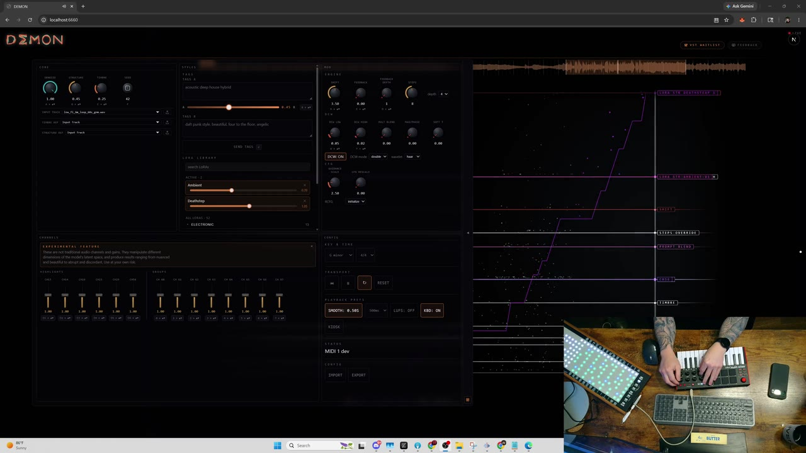
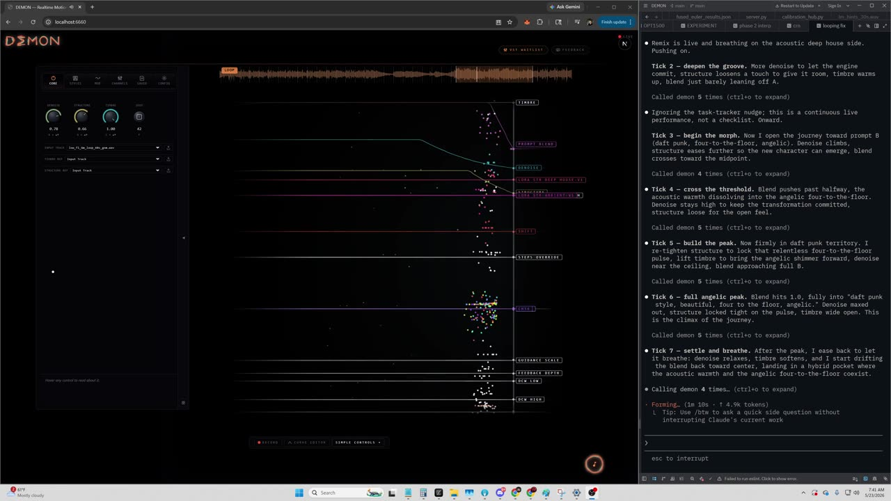

# DEMON

<p align="center"><strong>A platform for real-time music generation.</strong></p>
<p align="center"><sub>Diffusion Engine for Musical Orchestrated Noise</sub></p>

<p align="center">
  <a href="LICENSE"></a>
  
  <a href="#model-families"></a>
</p>

<p align="center">
  <a href="https://arxiv.org/abs/2605.28657"></a>
  <a href="https://music.daydream.live"></a>
</p>

<p align="center">
  
</p>
<p align="center"><sub><em>The DEMON realtime web demo — live control drawer, automation curves, and audio-reactive visuals.</em></sub></p>

DEMON is a platform for real-time music generation: one streaming engine, one wire protocol, one client SDK, and interchangeable generative model families behind it. A pod boots one family (`--checkpoint <alias>`), and every client, demo and integration talks the same protocol whichever family is loaded. Two families are featured. [Stable Audio 3](https://huggingface.co/stabilityai/stable-audio-3-small-music) runs through the same streaming diffusion pipeline, with per-frame curves, prompt morphing and audio-to-audio from an uploaded source; its demo is at `/sa3/`. [ACE-Step v1.5](https://huggingface.co/ACE-Step/Ace-Step1.5), the original family, has the deepest controls: every modulation parameter is a per-frame knob you can sweep while the model plays, and the streaming output is bit-identical to a batch run. Magenta RealTime 2, MiniMax-Music3 and YuE2 are experimental.

> Don't have a GPU, or just want to play first? Try the hosted instance at **[music.daydream.live](https://music.daydream.live)**.

## Contents

- [What DEMON is](#what-demon-is)
  - [Model families](#model-families)
  - [Benchmarks (RTX 5090)](#benchmarks-rtx-5090)
  - [Limitations](#limitations)
- [Quickstart](#quickstart)
- [Features](#features)
- [Performance](#performance)
- [Tuning](#tuning)
- [Acceleration backends](#acceleration-backends)
- [Programmatic use: the Session API](#programmatic-use-the-session-api)
- [Building TensorRT engines](#building-tensorrt-engines)
- [Demo applications](#demo-applications)
- [Engine internals](#engine-internals)
- [How DEMON compares](#how-demon-compares)
- [Research & citation](#research--citation)
- [Contributing](#contributing)
- [Acknowledgments](#acknowledgments)
- [Authors](#authors)
- [License](#license)

## What DEMON is

DEMON streams music from a generative model while you steer it. The runtime is shared: the streaming runner, the WebSocket wire protocol, the knob manifest, the client SDK ([`packages/demon-client`](packages/demon-client/)), the bundled demos and the integrations. The model is a *family* plugged in behind it. Each family declares what it supports (capabilities, knobs, handshake fields), and clients read that from the protocol instead of assuming a model.

DEMON began as a streaming diffusion engine for ACE-Step v1.5 (described in the [paper](https://arxiv.org/abs/2605.28657)), and that engine is still the core of the Stable Audio 3 and ACE-Step families and runs YuE2's acoustic stage. Think StreamDiffusion, for audio: a ring buffer holds several in-flight generations at different denoising stages, advanced together per tick. After warmup, finished latents stream out at a steady rate of `depth/steps` generations per tick. End-to-end TensorRT keeps the tick tight; per-frame modulation knobs accept scalars or `[T]` curves and are hot-mutable mid-stream; ring buffer depth itself is hot-resizable. Streaming output is bit-identical to batch.

### Model families

| Family | Status | Kind | Steering | Boot alias |
|---|---|---|---|---|
| [Stable Audio 3](https://huggingface.co/stabilityai/stable-audio-3-small-music) (small-music, medium) | Featured | Streaming diffusion through the shared pipeline, via a model adapter | Per-frame curves and prompt morphing (shared with ACE-Step through `StreamPipeline`); audio-to-audio from an uploaded source | `sa3-small`, `sa3-medium` |
| [ACE-Step v1.5](https://huggingface.co/ACE-Step/Ace-Step1.5) (turbo 2B, XL turbo 5B) | Featured; the default install | Streaming diffusion, in process | Per-frame curves on every solver knob, prompt A/B morphing, LoRA hot-swap, timbre and structure references, audio in | none (default); `xl` for XL turbo |
| Magenta RealTime 2 (`mrt2_small`, `mrt2_base`) | Experimental | Autoregressive, in a JAX sidecar process | Prompt A/B blend (MusicCoCa embeddings), sampling and guidance knobs; append-only, text only | `mrt2-sidecar` |
| [MiniMax-Music3](https://huggingface.co/MiniMaxAI/MiniMax-Music3) | Experimental. Just barely fits on an RTX 5090: a session uses 28.7 GB of the card's 32 GB, and it does not fit a 24 GB card. It is slow, ~1.3x realtime. | Autoregressive language model plus a flow-matching renderer, in process | Style prompt (re-prefills against the audio already written), lyrics at connect; a random composition seed per session, or `minimax_seed` to replay a piece; append-only, text only, no prompt blend | `minimax-music3` |
| [YuE2](https://github.com/multimodal-art-projection/YuE) (3B) | Experimental | Song-level, in process: semantic AR (plan + semantic tokens) as cached conditioning, 32-step acoustic flow matching in the ring | `yue2_denoise`, `x0_target`, `feedback`, `seed` through the ring; a prompt change re-composes the song in the background; lyrics and duration at connect | `yue2-3b` |

Per-frame curves, morphing and audio input are diffusion-family features (Stable Audio 3 and ACE-Step; LoRAs, timbre and structure references are ACE-Step's). Magenta RealTime 2 and MiniMax-Music3 are append-only streams steered by prompt (and lyrics); they ignore uploaded audio. YuE2 composes a whole song from a style prompt and lyrics, then reshapes it in the ring with a few knobs; it has no per-frame curves, LoRA or CFG.

The pod picks its family at boot from `--checkpoint`, and a client that omits `backend` from its handshake gets the pod's family. Switching families means restarting the server with another alias. Prerequisites, knobs and known gaps for each family, and the contract for adding one, are in [docs/FAMILIES.md](docs/FAMILIES.md).

### Benchmarks (RTX 5090)

| Family | Throughput | Control latency | Session start | VRAM |
|---|---|---|---|---|
| Stable Audio 3 (medium, TensorRT fp16mixed, 8 steps, 54-60 s song) | 6.2-6.3 generations/s at depth 1, 4 and 8 (tick 20 / 80 / 159 ms) | knob change converged in 218 ms at depth 1, 1.2 s at depth 4; prompt change acknowledged in 78 ms, first audible at 250 ms, fully audible at 3.2 s (depth 4) | 16.6-20.2 s from config to ready on a cold first session (model and engine load; one run took 26.0 s), first slice 0.9-1.2 s after ready | 5.4 GB allocated by torch; 8.3-10.7 GB of device memory per session, TensorRT engines included |
| ACE-Step v1.5 (turbo 2B, all-TRT, depth 4, 8 steps, 60 s) | ~43 ms tick, 11.3 generations/s | ~248 ms parameter convergence | ~15 s first start (model and engine load) | fits a 24 GB card with the 60 s engines (see [Tuning](#tuning)) |
| Magenta RealTime 2 | `mrt2_small` ~1.7x realtime; `mrt2_base` ~0.93x | `mrt2_lead`, 0.75 s by default | sidecar JIT warmup ~30 s, once, before the server boots | not yet measured |
| MiniMax-Music3 | ~1.3x realtime steady (1.29x; AR stage 1.54x, renderer 7.8x): a slim margin | 3.3-3.6 s to the delivery frontier (renderer guidance, AR temperature, prompt), plus the playback lead | roughly half a minute to first audio on a fresh server (session create ~27-28 s cold, first audio 21-34 s after Start); with the model already loaded, ~6 s from generation start to first audio | 28.7 GB of the 5090's 32 GB for a whole session (AR stage 17.4 GB resident, KV cache 2.8 GB, TensorRT DiT 4.88 GB): just barely fits |
| YuE2 | tick p50 70 ms at a 60 s song (TensorRT), 119 ms at 30 s (eager); one full solve is 32 ticks | `seed` / `x0_target` 2.4-2.5 s at 60 s, 4.0 s at 30 s; `yue2_denoise` 0.5: 1.2 s; prompt change 21-42 s (idle ring), 36-58 s (busy ring) | composition at create for a 60 s song: plan 5.7 s, semantic 9.5 s, anchor solve 2.5-2.7 s; ready 34.1 s after Start in a fresh server, model load included | peak 18.4 GB (30 s song) to 21-22 GB (60 s song), desktop included |

**Stable Audio 3 in detail.** The TensorRT DiT (fp16mixed) takes ~17 ms per step at a 60 s window, against ~54 ms eager. Throughput is flat across ring depth: 6.30, 6.16 and 6.27 generations/s at depth 1, 4 and 8, because the tick grows with depth (20.0, 80.1 and 159.5 ms). Depth therefore buys smoother parameter glides, not speed, and costs control latency: a knob change converged in 218 ms at depth 1 and 1.2 s at depth 4. Use low depth for fast control; the generation rate stays the same. The figures are for the medium model on an RTX 5090; small-music is not yet measured.

Sources: Stable Audio 3 from the maintainers' benchmark runs on an RTX 5090 (medium model) and [`acestep/engine/sa3_trt.py`](acestep/engine/sa3_trt.py); ACE-Step from [Performance](#performance) and [Quickstart](#quickstart); the others from [docs/FAMILIES.md](docs/FAMILIES.md), [docs/MINIMAX.md](docs/MINIMAX.md) (§4, knob-to-frontier at hop 100) and [demos/mrt2/README.md](demos/mrt2/README.md). Latencies are measured differently per family (ACE-Step: parameter convergence; MiniMax-Music3: to the delivery frontier; YuE2: to CPU PCM), so compare them within a row, not across rows.

### Limitations

**Stable Audio 3**
- Ring depth does not raise throughput (6.2-6.3 generations/s at depth 1, 4 and 8); it trades control latency (218 ms at depth 1, 1.2 s at depth 4) for smoother glides.
- A cold first session takes 16.6-20.2 s to become ready (model and engine load). Figures are for the medium model; small-music is not yet measured.
- The weights are a manual download ([docs/INSTALL.md](docs/INSTALL.md)), and the model variant (small-music or medium) is fixed when the backend boots; the page cannot switch it.
- Generation length is fixed for the session (`sa3_duration_s`, or the uploaded source's length), up to 120 s.

**ACE-Step v1.5**
- Fixed-length canvas: a session renders one song length, set by the TensorRT profile (60 s by default; there is no per-session duration field). Longer profiles cost more VRAM and tick time.
- TensorRT engines are specific to the TensorRT version and GPU architecture; rebuild after changing either.
- A knob change settles over the ring (~248 ms parameter convergence at depth 4); higher depth glides more smoothly but responds later.

**Magenta RealTime 2**
- The model runs in a JAX sidecar in a Linux/WSL venv (no CUDA JAX on native Windows); the server talks to it over TCP.
- Append-only on a 60 s rolling window: changes are heard after `mrt2_lead`, nothing already generated is revised, and uploaded audio is ignored.
- Steering is prompt A/B blend plus sampling and guidance knobs only.
- `mrt2_small` runs ~1.7x realtime; `mrt2_base` ~0.93x, below realtime: it re-anchors repeatedly, so fresh audio arrives in bursts.
- One session per sidecar (a second one is told the sidecar is unreachable). A lost sidecar link ends the session with an error, and there is no reconnect.

**MiniMax-Music3**
- Just barely fits on an RTX 5090, and it is slow. A session uses 28.7 GB of the card's 32 GB; the ~3 GB left exists only because the eager DiT is parked on the host, and anything else on the card (a desktop took 1.7-4.6 GB in the measurements) eats into it. When the card fills, nothing reports it: frame times triple. It does not fit a 24 GB card (the renderer alone does; the renderer plus the resident AR stage does not). Throughput is ~1.3x realtime, a slim margin.
- Append-only autoregressive stream: no audio input, no prompt blend, and changes take seconds (3.3-3.6 s to the frontier), not milliseconds.
- Expect roughly half a minute before first audio on a freshly started server: session create (language model load and CUDA graph capture) takes ~27-28 s cold, and first audio arrived 21-34 s after Start. The ~6 s figure is generation start to first audio with the model already loaded; later sessions in the same server skip the load.
- No distilled DiT is used: the renderer runs the released model.
- Caption plus lyrics share a 512-token prompt budget: an over-long prompt fails session create, and on a live reprompt it is dropped. A prompt change after the piece has ended is dropped without a client-visible error.
- Licence: the MiniMax-Music3 Community License requires "MiniMax-Music3" to be displayed prominently in a product UI, and written authorisation above US$20M yearly revenue ([docs/MINIMAX.md](docs/MINIMAX.md)).

**YuE2**
- The acoustic flow-matching stage runs the released 32-step schedule, so one full solve is 32 ticks and sets the knob-to-ear floor. No distilled or turbo acoustic checkpoint exists upstream; YuE2-Turbo is a serving layer that speeds only the autoregressive stages. The family would work much better with a few-step turbo distillation of the acoustic flow-matching model.
- A prompt change needs a background re-compose of the song and is heard 21-42 s later on an idle ring, 36-58 s on a busy one. Lyrics and song length are fixed for the session.
- Ring depth is capped at 1 (depth 2 slowed every update by 40-75% with identical results).
- Songs under 40 s, and compositions over 4000 conditioning tokens, run the acoustic stage eager, with slower ticks.
- The weights are CC BY-NC 4.0: non-commercial use only.

**Who it's for:**

- **Live performers and VJs** driving audio from MIDI and automation curves in real time.
- **Researchers** extending the typed node graph or studying ACE-Step v1.5 internals.
- **App and plugin developers** building on a small, stable programmatic Session API.
- **ML engineers** who want TensorRT-accelerated streaming audio that stays bit-identical to batch.

The engine lives in [`acestep/`](acestep/). One process loads the model once and exposes two things:

1. A programmatic **Session API** ([`acestep/engine/session.py`](acestep/engine/session.py)) that wraps the streaming pipeline, the typed node graph, and the TRT runtime in a small set of methods (`prepare_source`, `encode_text`, `generate`, `decode`, `stream`, `apply_lora`).
2. A **typed node graph** ([`acestep/nodes/`](acestep/nodes/)) of 32 composable operations (latent / audio / conditioning / curve / mask / solver / config / DCW / channel guidance) wired through `NodeDefinition` / `NodePort` / `NodeParam`, with kwarg-validation at registration.

Anything on top — a CLI, a notebook, a VST, the bundled web demo, an MCP tool, or your own protocol — drives the same primitives. The library does not know or care which one you use.

## Quickstart

**You need:** an NVIDIA GPU (tested on RTX 3090 / 4090 / 5090; the demo fits on a 24 GB card), [uv](https://docs.astral.sh/uv/), Node.js 20+ (web demo only), and about 40 GB of free disk. Python 3.11 is installed for you by `uv sync`.

```bash
git clone https://github.com/daydreamlive/DEMON.git
cd DEMON
uv sync
uv run demon-setup
```

`demon-setup` checks your environment, downloads the ACE-Step v1.5 checkpoints (~18 GB from [`ACE-Step/Ace-Step1.5`](https://huggingface.co/ACE-Step/Ace-Step1.5) on Hugging Face, with a ModelScope fallback), fetches DEMON's pinned Stable Audio 3 source checkout, downloads a starter pack of genre LoRAs, and builds the minimal TensorRT engine set (the 60 s profile: decoder + VAE encode/decode, plus the fixed 1 s windowed VAE decode — a few minutes on a recent GPU since the ONNX comes prebuilt; older cards can take longer). It is idempotent: re-run it any time, finished work is skipped. (A first run is dominated by the ~18 GB checkpoint download plus the engine build; later runs skip straight to launch.)

`demon-setup` installs the ACE-Step family by default. Stable Audio 3 needs one more step: its weights are a manual download (only the source checkout comes with `demon-setup`).

### Stable Audio 3 (featured)

```bash
# small-music (or stable-audio-3-medium for the medium checkpoint)
huggingface-cli download stabilityai/stable-audio-3-small-music \
  --local-dir ~/.daydream-scope/models/demon/sa3/checkpoints/stable-audio-3-small-music
```

The SA3 UI is a separate static demo mounted at `/sa3/`. It starts
sessions with `backend: "sa3"`, but the SA3 model variant is resolved
when the backend boots from `--checkpoint`. Launch the backend with an
SA3 checkpoint alias before opening the page:

```bash
uv run python -u -m demos.realtime_motion_graph_web.run -- --checkpoint sa3-small
# or:
uv run python -u -m demos.realtime_motion_graph_web.run -- --checkpoint sa3-medium
```

Then open `http://localhost:6660/sa3/` (or `http://localhost:1318/sa3/`
if you are running the backend directly). Opening `/sa3/` against the
default ACE-Step checkpoint will not switch models; restart the backend
with `--checkpoint sa3-small` or `--checkpoint sa3-medium`.

### ACE-Step v1.5 (featured, the default install)

Launch the web demo:

```bash
uv run python -u -m demos.realtime_motion_graph_web.run
# open http://localhost:6660
```

**What you'll see and hear.** The page loads with a default fixture already selected. Click **Play** (browsers gate audio behind a click, so this also unlocks sound). The first start takes ~15 s while the model and TensorRT engines load (longer under `--accel compile`); then the HUD goes live and audio streams continuously. Once a session is playing, the spectral-control sliders live in the control drawer's **Experimental** tab; they steer generation itself, so changes land on the upcoming audio after a moment; sweep slowly and listen.

> **The bare launch command runs all-TensorRT by default**, which needs the engines `demon-setup` just built. If they are missing, the server exits at boot and prints the exact fix. If you ran `demon-setup --skip-engines`, you **must** launch with `-- --accel compile` (no engines needed; expect a long `torch.compile` warmup on the first tick).

**Where things live.** Everything downloads to `~/.daydream-scope/models/demon/` (override with the `ACESTEP_MODELS_DIR` environment variable), *not* into the repository: checkpoints under `<models dir>/checkpoints/`, Stable Audio 3 source under `<models dir>/sa3/vendor/`, TensorRT engines under `<models dir>/trt_engines/`. The ACE-Step models must be the v1.5 weights fetched by `demon-setup` (equivalently `uv run acestep-download`); do not substitute other checkpoints or paths. Full directory tree, manual download, engine-build options, headless/pod notes, and a troubleshooting table are in [docs/INSTALL.md](docs/INSTALL.md).

**Audio fixtures** pull on first use from the [`daydreamlive/demon-fixtures-v2`](https://huggingface.co/datasets/daydreamlive/demon-fixtures-v2) Hugging Face dataset (the older `daydreamlive/demon-fixtures` is kept as a fallback) and materialize under `<models dir>/fixtures/`. See [`acestep/fixtures.py`](acestep/fixtures.py) for the canonical set.

**Starter LoRAs.** `demon-setup` downloads a starter pack of 16 genre LoRAs (jazz, phonk, lo-fi, punk, acoustic, ambient, and deep house in 2B and XL variants, plus funk and deathstep; skip with `--skip-loras`). To add your own, drop a `.safetensors` file (optionally with a `<stem>.metadata.json` sidecar) anywhere under `$ACESTEP_MODELS_DIR/loras/` (defaults to `~/.daydream-scope/models/demon/loras/`) and it will appear in any consumer that scans the library on next refresh. See [`acestep/paths.py`](acestep/paths.py) and [`acestep/lora_metadata.py`](acestep/lora_metadata.py).

### Experimental families

Each boots with its own alias, and its demo page is served by the backend on `:1318`.

#### Magenta RealTime 2

Start the sidecar first, in a Linux/WSL venv with `magenta_rt`, JAX (CUDA) and numpy (no torch). It listens on `127.0.0.1:7531` after a ~30 s JIT warmup (override with `DEMON_MRT2_SIDECAR=host:port`):

```bash
python scripts/mrt2_sidecar.py --model mrt2_small
```

Then boot the server and open `http://localhost:1318/mrt2/` (the web app's `/magenta` page on `:6660` drives the same family):

```bash
uv run python -u -m demos.realtime_motion_graph_web.run -- --checkpoint mrt2-sidecar
```

#### MiniMax-Music3

**Hardware:** Just barely fits on an RTX 5090: a session uses 28.7 GB of the card's 32 GB, and it does not fit a 24 GB card. It is slow, ~1.3x realtime. Close other GPU work first.

Needs the diffusers layout of [`MiniMaxAI/MiniMax-Music3`](https://huggingface.co/MiniMaxAI/MiniMax-Music3) (~18 GB bf16 LM + 2.4B DiT + DAV decoder) under `DEMON_MINIMAX_DIR`, `<models dir>/minimax/checkpoints/MiniMax-Music3`, or the local Hugging Face cache. An optional fp16 TensorRT engine for the renderer is built by `acestep/engine/trt/minimax_build.py`; without it the renderer runs eager.

```bash
uv run python -u -m demos.realtime_motion_graph_web.run -- --checkpoint minimax-music3
# open http://localhost:1318/minimax/
```

#### YuE2

Runs in the server process, no sidecar. Set the environment (variables and the TensorRT engine build are in [docs/FAMILIES.md](docs/FAMILIES.md)), then start the server:

```bash
export DEMON_YUE2_ROOT=/path/to/yue2            # weights (YuE2-3B + codec)
export DEMON_YUE2_YUE_SRC=/path/to/YuE/src      # upstream YuE source at the pinned revision
export DEMON_YUE2_EXTRA_PATH=/path/to/extra-deps  # optional extra import path
export DEMON_YUE2_TRT_DIR=/path/to/engines      # optional; eager NAR without it
python -u -m demos.realtime_motion_graph_web.server --port 1318 --checkpoint yue2-3b
```

Open `http://localhost:1318/yue2/`. Lyrics and duration are fixed at Start; the page shows "composing" for the seconds of AR before the song plays.

## Features

These are the ACE-Step family's features. Stable Audio 3 shares the streaming pipeline (ring buffer, slot batching, shared curves and CFG) through its model adapter.

- **Streaming diffusion for ACE-Step v1.5** — a ring buffer of in-flight generations advanced one denoise step per tick; throughput is `depth/steps` finished generations per tick, and depth is hot-resizable mid-stream.
- **End-to-end TensorRT** — the DiT decoder and VAE encode/decode all run through TRT, and the decoder is refit-enabled so LoRA swaps never rebuild an engine.
- **Per-frame steering** — velocity, guidance, noise injection, x0 targets, and more each accept a scalar *or* a `[T]` curve, all hot-mutable mid-stream.
- **Heterogeneous slots** — mix a full regeneration, a style transfer, and an RCFG request in a single batched forward pass.
- **Typed 32-node graph + Session API** — compose latent / audio / conditioning / curve / mask / solver operations, and drive them from Python, a notebook, a VST, the web demo, or an MCP client.
- **Onboard MCP server** — every user-facing action in the web demo is exposed as an MCP tool, so an agent can drive a live session.
- **Bit-identical streaming vs. batch** — the streaming and one-shot paths compose the same pure step primitives and produce the same output.

See [Engine internals](#engine-internals) for the full mechanism behind each of these.

## Performance

These numbers are for the ACE-Step family; figures for every family are in [Benchmarks (RTX 5090)](#benchmarks-rtx-5090).

RTX 5090, ACE-Step v1.5 turbo (2B), all-TRT, `depth=4`, `steps=8`, `vae_window=3s`, 60 s source.

| Metric | Value |
|---|---|
| Tick (decoder forward, depth=4) | ~43 ms |
| Decode (windowed VAE, 3 s) | 4.5 ms |
| Throughput | 11.3 generations/second |
| Parameter convergence | ~248 ms |
| Per-frame control resolution | 25 Hz (40 ms latent steps) |
| Streaming vs. batch quality | bit-identical output |

Tested on NVIDIA RTX 3090, 4090, and 5090. The demo fits comfortably on a 24 GB card such as an RTX 4090 (see the VRAM breakdown under [Tuning](#tuning)).

## Tuning

This section applies to the ACE-Step family.

Three knobs trade off against each other. Picking the right point on the curve is what makes DEMON run well on a given card.

- **Ring buffer depth (`pipeline_depth`, 1 to 8).** The pipeline keeps `depth` in-flight generations at different denoise stages, advanced together each tick. Higher depth makes parameter sweeps glide more smoothly (more slots in different denoise phases, so a curve change blends through finer intermediate states) at the cost of more per-tick batch compute and higher VRAM; lower depth feels snappier and more discrete, with lower per-tick VRAM and compute.
- **Song duration.** TRT engines are profile-specific, and each reserves workspace sized to its profile — so a 240 s engine costs more VRAM and more per-tick latency than a 60 s engine even when the workload is only 60 seconds. Build only the durations you need (see the VRAM breakdown below).
- **VAE windowing.** Optional, and the demo's default. When `vae_window > 0`, every streaming decode runs through the fixed 1 s windowed engine: 25 latent frames go in, the middle `vae_window` seconds (keep range 0.04 to 0.36 s) come out, and the surrounding frames are receptive-field margin that gets trimmed. Only the requested window is decoded per call rather than the full latent — this is what unlocks low-latency streaming updates. Set to 0 to fall back to full-length decode through the `vae_decode` engine.

<details>
<summary><strong>Per-engine VRAM: 60 s vs 240 s profiles (5090)</strong></summary>

Each engine reserves workspace sized to its profile, so a 240 s engine costs more VRAM than a 60 s engine even when the workload is only 60 seconds. Per-engine peak workspace, each measured in isolation on a 5090:

| Component       | 60s engine | 240s engine |          Δ |
|-----------------|-----------:|------------:|-----------:|
| Decoder (refit) |  13,511 MB |   15,911 MB |  +2,400 MB |
| VAE decode      |  10,547 MB |   10,814 MB |    +267 MB |
| VAE encode      |   4,178 MB |   10,614 MB |  +6,436 MB |

These are per-engine peaks captured in separate subprocesses, not a live-runtime sum. At inference time the decoder peak dominates and the VAE workspaces do not peak alongside it, which is why the live demo fits on a 24 GB card. The comparison is what matters: switching three engines from 240 s to 60 s frees about 9 GB. Source: [`scripts/benchmarks/vram_60s_vs_240s_results.md`](scripts/benchmarks/vram_60s_vs_240s_results.md). Longer engines also pay more per-tick latency since the diffusion sequence length scales with duration.

</details>

## Acceleration backends

These backends apply to the ACE-Step family; other families document their own acceleration in [docs/FAMILIES.md](docs/FAMILIES.md).

The DiT decoder and the VAE pick a backend independently. Three values each: `tensorrt`, `compile`, `eager`.

| Component         | Backend     | Notes |
|-------------------|-------------|-------|
| Decoder           | `tensorrt`  | Fastest. Requires a built decoder engine for the target duration and checkpoint. Refit-enabled engines support LoRA swaps. |
| Decoder           | `compile`   | `torch.compile`. Long warmup, no engine to build, good fallback. |
| Decoder           | `eager`     | Plain PyTorch. Useful for debugging. |
| VAE encode/decode | `tensorrt`  | Fastest. The windowed-decode engine (`vae_decode_fp16_1s_fixed`) is built once and reused across all durations. |
| VAE encode/decode | `compile`   | `torch.compile`. |
| VAE encode/decode | `eager`     | Plain PyTorch. |

From the bundled web demo, pass `--accel {tensorrt|compile|eager}` to set both at once, or `--decoder-accel` / `--vae-accel` to override one component at a time:

```bash
# All-TRT (recommended).
uv run python -u -m demos.realtime_motion_graph_web.run -- --accel tensorrt

# TRT decoder, eager VAE (e.g. for debugging the decode path).
uv run python -u -m demos.realtime_motion_graph_web.run -- \
    --accel tensorrt --vae-accel eager
```

**Recommended baseline: TRT windowed VAE decoder at minimum.** It is the cheapest TRT engine to build, it is checkpoint- and duration-agnostic, and it unlocks the low-latency streaming path. Pair it with `--decoder-accel compile` if you do not want to build the decoder engine yet.

## Programmatic use: the Session API

This section applies to the ACE-Step family. Every family is reachable through the wire protocol and the client SDK.

The Session API is the engine's primary surface. Load the model once, then iterate.

```python
from acestep.engine.session import Session
from acestep.constants import TASK_INSTRUCTIONS

session = Session(
    decoder_backend="compile",  # or "tensorrt", "eager"
    vae_backend="compile",
    vae_window=0.36,            # 0 = full decode; >0 enables windowed decode
)

# Load audio, encode it, extract semantic context (cache across iterations).
source = session.prepare_source(audio)

# Encode text once. Reused across generations.
cond = session.encode_text(
    tags="deathstep death",
    instruction=TASK_INSTRUCTIONS["cover"],
    refer_latent=source.latent,
    bpm=136, duration=60.0, key="G# minor",
)

# Generate, decode, save. Cheap after warmup (~310 ms per iteration).
for seed in [1528, 9999, 42]:
    latent = session.generate(
        conditioning=cond,
        context_latent=source.context_latent,
        source_latent=source.latent,
        seed=seed,
    )
    save_audio(session.decode(latent), f"out_{seed}.wav")
```

Streaming is the same primitives wrapped in a `StreamHandle`:

```python
handle = session.stream(source=source, conditioning=cond, pipeline_depth=4)
for _ in range(N_TICKS):
    # Mutate handle.conditioning / handle.context_latent between ticks
    # to swap prompts or blend semantic hints live.
    latent = handle.tick()
    if latent is not None:
        audio = handle.decode(latent, t_start=window_start_s)

# Per-frame curve overrides bypass the ring buffer (1-tick latency):
handle.pipeline.set_shared_curve("velocity_scale", 1.2)
handle.pipeline.set_shared_curve("sde_denoise_curve", torch.tensor([...]))
```

Quick-start scripts:

- [`examples/session_demo.py`](examples/session_demo.py): persistent session, iterate covers with different seeds.
- [`examples/realtime_cover.py`](examples/realtime_cover.py): a full real-time cover workflow with dual prompts, dual LoRAs, timbre / hint references, temporal masking, and engine-exclusive per-frame curves.
- [`examples/covers/`](examples/covers/): one standalone script per feature.

<details>
<summary><strong>All per-feature example scripts</strong></summary>

| Script | Feature |
|---|---|
| `cover_basic.py` | Standard cover pipeline (encode, condition, generate, decode) |
| `prompt_blend.py` | Two prompts blended with a temporal curve |
| `sde_denoise_curve.py` | Per-frame SDE re-noise modulation |
| `velocity_scaling.py` | Per-frame transformation rate control |
| `lora_generation.py` | LoRA-conditioned generation |
| `x0_target_blend.py` | Two-pass morphing toward a target latent |
| `conditioning_average.py` | Fuse two conditionings |
| `guidance_curve.py` | Per-frame CFG scale |
| `latent_noise_mask.py` | Latent-space inpainting |
| `initial_noise_curve.py` | Per-frame noise / source init mix |
| `ode_noise_injection.py` | Stochastic ODE step |
| `cover_semantic_blend.py` | Blend semantic hints from two sources |
| `x0_target_from_reference.py` | Pre-generate a target latent, morph toward it |

</details>

## Building TensorRT engines

These engines are for the ACE-Step family.

DEMON targets TensorRT 10.16.x. Plans are version- and GPU-architecture-specific by default, so rebuild after changing TensorRT, CUDA, driver, or the GPU used for inference. The minimal set for the realtime web demo (what `demon-setup` builds) is the 60 s profile (decoder + VAE encode/decode) plus the fixed 1 s windowed VAE decode:

```bash
uv run python -m acestep.engine.trt.build --preset minimal
```

ONNX intermediates are duration-agnostic and auto-reused across builds; the model is only loaded when an export is actually needed. For the full build matrix, precision recipes, the XL/FP8 path, and engine naming, see [docs/TRT.md](docs/TRT.md).

<details>
<summary><strong>All build commands &amp; on-disk engine layout</strong></summary>

```bash
# Minimal set for the realtime web demo (what `demon-setup` builds):
# the 60s profile (decoder + VAE encode/decode) + fixed 1s windowed VAE decode.
uv run python -m acestep.engine.trt.build --preset minimal

# Full matrix (decoder refit + VAE encode/decode for 60s / 120s / 240s).
uv run python -m acestep.engine.trt.build --all

# 60s only (recommended starting point).
uv run python -m acestep.engine.trt.build --all --duration 60

# Just the windowed VAE decoder (smallest, fastest to build, biggest payoff).
uv run python -m acestep.engine.trt.build --vae-only --duration 60

# Preview what would be built.
uv run python -m acestep.engine.trt.build --all --dry-run

# Force rebuild even if engines already exist.
uv run python -m acestep.engine.trt.build --all --force-rebuild

# Force ONNX re-export as well.
uv run python -m acestep.engine.trt.build --all --duration 60 --force-rebuild --force-onnx
```

```
~/.daydream-scope/models/demon/trt_engines/
  _onnx_vae/                      # shared across checkpoints, auto-reused
    vae_encode/vae_encode.onnx
    vae_decode/vae_decode.onnx
  _onnx_acestep-v15-turbo/        # checkpoint-specific
    decoder_refit/decoder_refit.onnx   # + external data shards
  spectral_decoder_mixed_refit_b8_60s/
    spectral_decoder_mixed_refit_b8_60s.engine
  vae_encode_fp16_60s/
    vae_encode_fp16_60s.engine
  vae_decode_fp16_1s_fixed/       # windowed decode, duration-independent
    vae_decode_fp16_1s_fixed.engine
  ...
```

Pass engine paths to `Session` when using the API directly (`acestep.paths.select_trt_engines` / `available_trt_engines` resolve these for you):

```python
from acestep.paths import available_trt_engines

engines, picked_dur = available_trt_engines(duration_s=60.0)
session = Session(
    decoder_backend="tensorrt",
    vae_backend="tensorrt",
    vae_window=0.36,
    trt_engines=engines,
)
```

</details>

## Demo applications

The engine is meant to be driven. The repository ships a flagship reference application plus a handful of focused entry points.

### realtime_motion_graph_web (the headline demo)

A Python backend plus a Next.js front-end in a single launcher. Feed it audio and a prompt, then twist knobs, draw automation curves, blend prompts, hot-swap timbre / structure references, and toggle LoRAs while the model generates and plays back continuously. Most of the engine surface above is exposed as a live control.

```bash
uv run python -u -m demos.realtime_motion_graph_web.run
# then open http://localhost:6660
```

The launcher starts the backend on `:1318` and the Next.js dev server on `:6660`. First run installs the web app and shared SDK (`packages/demon-client`) `node_modules` automatically. Forward backend flags after `--`:

```bash
uv run python -u -m demos.realtime_motion_graph_web.run -- --accel tensorrt
uv run python -u -m demos.realtime_motion_graph_web.run -- --checkpoint xl
```

External static demo repos can be mounted at runtime with `--demo <path>`. DEMON serves them as already-built static files and prints their direct URLs at startup:

```bash
uv run python -u -m demos.realtime_motion_graph_web.run --demo C:\path\to\demo
```

Those repos own any browser/CDN/build dependencies; DEMON only provides static hosting plus the shared browser SDK at `/sdk/demon-client.js`. For concrete no-build examples, see [`daydreamlive/demon-example-apps`](https://github.com/daydreamlive/demon-example-apps):

```bash
git clone https://github.com/daydreamlive/demon-example-apps.git
uv run python -u -m demos.realtime_motion_graph_web.run --demo C:\path\to\demon-example-apps\apps\summon
```

Highlights:

- **Prompt A ↔ B blending.** Two text fields plus a blend slider. One encoder pass per submission; the slider lerps per tick.
- **LoRA library.** Browse genre-grouped LoRAs, click to enable, drag faders for strength. Optional auto-prepend of trigger words to keep prompts honest.
- **Timbre and structure references.** Independent fixtures, uploaded clips, or short mic recordings bias instrument character and section / rhythm / dynamics. Mix freely.
- **Source-audio swap.** Library, upload, or record a 60 s snippet from your mic.
- **Schedule curves.** Draw automation over the timeline for denoise, hint strength, feedback, shift, and any LoRA strength. Smooth / linear / step interpolation.
- **MIDI learn.** Right-click any slider, wiggle a physical control, done. Mappings persist per option-profile.
- **Audio-reactive video.** WebGL2 shader pipeline with saturation-driven color parallax and bloom-on-kick.
- **Recording.** Capture audio (Opus/WebM, AAC/M4A fallback) or the live graph canvas as video with audio muxed in.
- **Config import / export.** Snapshot full live session state (knobs, prompts, LoRAs, curves) to JSON.
- **Onboard MCP server.** Every user-facing action exposed as an MCP tool. Drive the demo from Claude Code or any MCP client.

<p align="center">
  
</p>

All defaults (knob positions, walk-window behavior, idle reset, LUFS matcher, audio-reactive shader params, XL-checkpoint overrides) live in [`demos/realtime_motion_graph_web/web/public/config.json`](demos/realtime_motion_graph_web/web/public/config.json). Edit, refresh, done.

See [`demos/realtime_motion_graph_web/README.md`](demos/realtime_motion_graph_web/README.md) for backend args, wire protocol, onboard MCP setup, and the front-end architecture.

### Other entry points

- [`examples/session_demo.py`](examples/session_demo.py): one-shot generation, persistent session.
- [`examples/realtime_cover.py`](examples/realtime_cover.py): real-time cover workflow exercising dual prompts, dual LoRAs, timbre / hint references, temporal masking, and engine-exclusive per-frame curves.
- [`examples/covers/`](examples/covers/): standalone per-feature scripts (see the table under [Programmatic use](#programmatic-use-the-session-api)).
- [`demos/test_stream_cover_graph.py`](demos/test_stream_cover_graph.py): a streaming cover graph driven from Python.

## Engine internals

These mechanisms make up the streaming diffusion pipeline behind the ACE-Step family; Stable Audio 3 uses the same pipeline through its model adapter.

The capabilities listed under [Features](#features) come from a handful of mechanisms in the streaming pipeline. The full surface:

<details>
<summary><strong>The full engine surface (click to expand)</strong></summary>

- **Streaming diffusion for ACE-Step v1.5.** `StreamPipeline` ([`acestep/engine/stream.py`](acestep/engine/stream.py)) maintains a ring buffer of in-flight generations. Each tick runs a batched decoder forward pass (two when CFG is active: positive + negative) that advances every active slot by one denoising step. The decoder dispatches to TensorRT or PyTorch through the same code path. Depth is hot-resizable mid-stream (`pipeline.set_depth(n)`); active slots drain naturally.
- **Heterogeneous slots.** Every in-flight slot carries its own `SlotRequest`: its own seed, its own `denoise` strength (with its own cached timestep schedule), its own source latent, its own per-frame curves, its own conditioning (one or more `SlotCondition`s with per-frame `temporal_weight` and per-condition `step_range`), its own CFG mode, its own x0 target, and its own latent-noise mask. A single ring buffer can mix a `denoise=1.0` regeneration, a `denoise=0.5` style transfer, and an RCFG-`self` request simultaneously and batch them in one forward pass.
- **Scalar-or-curve per-frame modulation.** Velocity scale, SDE re-noise, ODE noise injection, guidance scale, x0 target strength, x0 target curve, initial noise mix, APG momentum, CFG rescale, DCW scalers, and condition temporal weights all accept either a Python scalar or a `[T]` tensor, canonicalized through `normalize_curve` at the boundary so the kernels see one shape.
- **Channel guidance.** A `[1, T, 64]` per-channel gain applied to `xt` before each forward pass. Lives in its own surface (set via `pipeline.set_channel_gain_tensor(...)`) because its per-channel-and-per-frame shape doesn't fit the `[T]`-curve pattern.
- **Shared mutable curves.** Layered on top of the heterogeneous slots: `pipeline.set_shared_curve(name, value)` overrides one of the curve-shaped fields (`velocity_scale`, `sde_denoise_curve`, `ode_noise_curve`, `guidance_curve`, `apg_momentum`, `x0_target_strength`, `cfg_rescale_curve`) for the next tick on every in-flight slot at once. The override takes effect immediately rather than waiting for new submissions to make their way through the pipeline. Pass `None` to revert that name to per-slot behavior.
- **Multi-condition compositing.** Within a single slot, the decoder runs once per active condition and velocities are blended per frame by `temporal_weight`; conditions are gated in and out of the schedule by `step_range`. `ConditioningBlend` (scalar alpha) and `ConditioningCombine` (per-frame temporal weights) are the typed entry points.
- **Three CFG modes.** Standard CFG (uncond forward every step), RCFG-`initialize` (one uncond forward per slot, cached for the rest of the schedule), and RCFG-`self` (zero uncond forwards: the slot's initial noise stands in as the virtual uncond velocity). All three layer APG momentum and an optional per-frame CFG rescale curve on top.
- **Latent-noise-mask inpainting.** Two-sided x0 blending matching ComfyUI semantics: pre-blend on `xt` (so the decoder sees correctly-noised context in preserved regions) and post-blend on the predicted `x0`. Supports a per-step strength function for progressive masking.
- **DCW post-step correction.** Wavelet-domain sampler-side correction from Yu et al. CVPR 2026, ported from upstream ACE-Step v0.1.7. Four modes (low / high / double / pix), with an optional advanced surface (`mult_blend`, `mag_phase`, `soft_thresh`) that at zero is byte-identical to the upstream reference. Hot-updatable via `pipeline.set_dcw(...)`.
- **Hot LoRA.** Register a directory once, then enable / set_strength / remove without rebuilding anything. The LoRA manager ([`acestep/engine/lora.py`](acestep/engine/lora.py)) handles the lifecycle and delta math; when the decoder is in TRT mode, applies route through a refitter against the live engine.
- **TRT acceleration end-to-end.** The DiT decoder, VAE encode, and VAE decode each pick `tensorrt | compile | eager` independently. The TRT decoder is refit-enabled, so LoRA swaps do not rebuild the engine. The VAE decode has a windowed variant (`vae_decode_fp16_1s_fixed`, a fixed 1 s profile) that is built once and reused across all durations; the caller specifies the window start via `t_start`.
- **Bit-identical streaming vs. batch.** The streaming and one-shot paths compose the same pure step primitives from [`acestep/engine/ode_steps.py`](acestep/engine/ode_steps.py); they produce the same output.

</details>

## How DEMON compares

Most music generation servers wrap one model. DEMON puts one protocol and one SDK in front of several model families, and clients read each family's capabilities and knobs from that protocol instead of hard-coding a model.

For the ACE-Step family, DEMON is to audio what StreamDiffusion is to images: a streaming, real-time-steerable diffusion runtime. Here is how it relates to its closest points of reference (a relationship map, not a benchmark):

| | DEMON | ACE-Step v1.5 (upstream) | StreamDiffusion |
|---|---|---|---|
| Modality | Music / audio | Music / audio | Images |
| Generation | Streaming ring buffer of in-flight denoise stages | One-shot batch | Streaming ring buffer (the image analogue) |
| Per-frame control | Every knob is a scalar or a `[T]` curve, hot-mutable mid-stream | Per-generation parameters | — |
| Ring-buffer depth | Hot-resizable mid-stream | — | — |
| Streaming vs. batch | Bit-identical output | Batch only | — |
| Acceleration | End-to-end TensorRT (decoder + VAE) | — | TensorRT |

## Research & citation

The main DEMON paper is on arXiv; two companion technical notes are forthcoming:

- **[DEMON: Diffusion Engine for Musical Orchestrated Noise](https://arxiv.org/abs/2605.28657)** — the main paper (arXiv:2605.28657)
- FastOobleckDecoder (VAE distillation) — *forthcoming*
- Latent Channel Semantics (64-channel VAE characterization) — *forthcoming*

If you use DEMON in your work, please cite DEMON and the model of the family you used. For the ACE-Step family:

```bibtex
@article{fosdick2026demon,
  title   = {DEMON: Diffusion Engine for Musical Orchestrated Noise},
  author  = {Fosdick, Ryan},
  journal = {arXiv preprint arXiv:2605.28657},
  year    = {2026}
}

@software{demon,
  author = {Fosdick, Ryan},
  title  = {DEMON: Diffusion Engine for Musical Orchestrated Noise},
  year   = {2026},
  url    = {https://github.com/daydreamlive/DEMON}
}

@article{acestep2026,
  title   = {ACE-Step 1.5: Pushing the Boundaries of Open-Source Music Generation},
  author  = {Gong and others},
  journal = {arXiv preprint arXiv:2602.00744},
  year    = {2026}
}
```

## Contributing

Contributions are welcome. The maintained agent/developer guide is [AGENTS.md](AGENTS.md) — it covers the dev setup, the contract-first control surface (knobs and the wire protocol each live in exactly one registry), and how to regenerate the generated TypeScript types after a registry change. Run the test suite with:

```bash
uv run pytest tests/
```

Then open a pull request or file an issue on GitHub.

## Acknowledgments

DEMON began as a streaming engine for [ACE-Step](https://github.com/ace-step/ACE-Step) v1.5 and still owes its deepest controls to that model. DEMON does not train or own any of the models it runs; each family is its upstream team's work:

- **Stable Audio 3**: Stability AI ([`stabilityai`](https://huggingface.co/stabilityai) on Hugging Face).
- **ACE-Step v1.5**: the ACE-Step team. The base diffusion model, VAE, text encoder, and 5 Hz LM are all ACE-Step's work; without them, none of this exists. Huge thanks for releasing the v1.5 weights and code under MIT.
- **Magenta RealTime 2**: Google Magenta (`magenta_rt`).
- **MiniMax-Music3**: MiniMax ([`MiniMaxAI/MiniMax-Music3`](https://huggingface.co/MiniMaxAI/MiniMax-Music3)).
- **YuE2**: the m-a-p YuE team ([`multimodal-art-projection/YuE`](https://github.com/multimodal-art-projection/YuE); weights [`m-a-p/YuE2-3B`](https://huggingface.co/m-a-p/YuE2-3B)). The weights are CC BY-NC 4.0 (code Apache-2.0) and are not cleared for hosted or commercial use.

If you use DEMON in your work, please also cite the upstream model you ran.

## Authors

DEMON originally created by Ryan Fosdick ([@RyanOnTheInside](https://ryanontheinside.com)). Maintained by [Daydream Live](https://daydream.live) and contributors.

## License

DEMON is distributed under the **GNU Affero General Public License v3.0 or later** (`AGPL-3.0-or-later`); see [`LICENSE`](LICENSE) for the full text. Among other things, this means modified versions made available to users over a network must offer those users the corresponding source code (AGPL §13).

Portions of DEMON are derived from [ACE-Step](https://github.com/ace-step/ACE-Step), originally released under the MIT license. The original MIT notice is preserved in [`LICENSE-MIT`](LICENSE-MIT) as required by that license; the ACE-Step portions remain available under MIT on their own terms, while the combined work is offered under AGPL-3.0-or-later.
